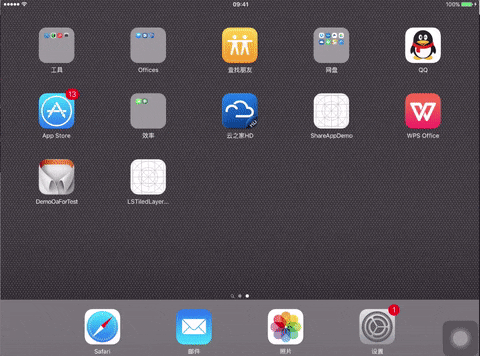
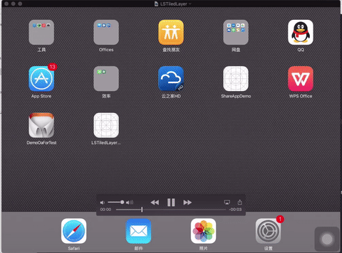

# LSTiledLayer
more powerful CATiledLayer

## 先来看下效果图

### CATiledLayer 效果

### LSTiledLayer 效果

从以上的两张效果图，我们可以仔细观察，会发现系统CATiledLayer在展现的过程中，我们能看到渐变的过程，而LSTiledLayer在展现的过程中直接展示整屏的内容。是否我们可以认为LSTiledLayer比系统的CATiledLayer更快呢！！

[请点击我吧！！！这里有一篇文章，更加详细的介绍LSTiledLayer到底有什么飞跃性的性能变化，优点，缺点又有什么](https://jsonseng.github.io/LSTiledLayer-Project/)

---

## 如何使用

如果你想改变一个UIView的绘制方法，只需要修改其 +(Class)layerClass 接口就可以完成了

~~~ iOS

+ (Class)layerClass
{
    return [LSTiledLayer class];
}

~~~

---

## 提供的属性

### 分块绘制的大小

~~~ iOS

@property CGSize tileSize;

~~~

### 线程绘制选择

~~~ iOS

@property BOOL isMainThread;

~~~

默认为NO，修改此属性可以让绘制进行在主线程。以用于应对频繁交互情况较少，但需要快速看到结果的情况下。比如缩放放手的一瞬间，此时更加偏向立刻展示内容，不然存在延迟展示，而可能让用户产生一定的焦虑感

---

## 反馈

[欢迎各位提出意见，问题，毕竟小弟能想到的内容，测试的力度有限，是否存在没考虑周到的方面，欢迎大家一起来交流，邮箱地址luckseng@gmail.com](mailto:luckseng@gmail.com)
